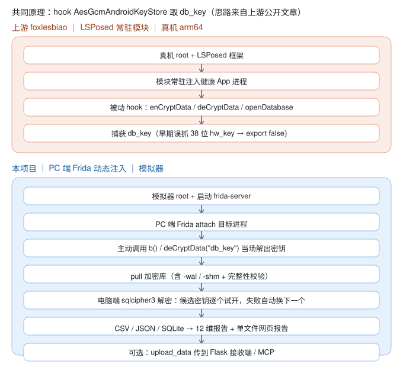

# OPPO 健康数据导出与分析工具集

> **项目名**：oppo-health-data-toolkit ｜ **版本**：V1.1 ｜ 许可证：MIT
>
> 从 OPPO 健康 App 中导出属于你的健康数据：自动获取加密密钥 → 拉取数据库 → 电脑端解密 → 导出 CSV / JSON / SQLite → 生成 12 维 MD 分析报告（2 个时间窗口）与离线网页报告（4 个时间窗口 × 六模块）。
> 当前版本已在 **雷电 14（Android 14）** 完成全链路实测；**MuMu 12+（Android 15）支持暂缓**——手册保留其差异说明（su 垫片、端口 16384 等）供后续版本使用，最新代码未在 MuMu 上实测。

**目录**：[功能特性](#功能特性) · [快速开始](#快速开始) · [目录结构](#目录结构) · [大文件分卷](#大文件随仓库分卷分发dist-目录) · [隐私与安全](#隐私与安全说明) · [技术路线](#技术路线本项目-vs-上游-foxlesbiao) · [免责声明](#免责声明) · [License](#license) · [写在最后](#写在最后)

## 功能特性

**把属于你的 OPPO 健康数据，从手机完整搬到电脑，自动整理成能看、能查的报告。**

- **一条命令完成导出**——连上模拟器运行一个脚本，自动取数据、解密并导出为 CSV / JSON / SQLite 三种格式，无需手工操作。
- **12 维健康分析报告**——睡眠、心率、HRV、运动、压力、血氧、睡眠呼吸等逐项分析，给出综合评分、最需关注的 3 个问题和一份 7 天改善计划。
- **可离线打开的网页报告**——单文件 HTML，双击即可查看，支持「昨天 / 近 3 天 / 近 7 天 / 近 30 天」四个时间范围，图表可交互。
- **按天拆分**——把数据按日期拆成独立小库，方便存档或分段分析。
- **导出后自动体检**——导出流程内置 7 项完整性检查（表数量 / 必需表 / 总行数 / 睡眠 / 心率 / 血氧 / 日期范围），数据缺失或异常会提前提示；另有独立的 `data_validation.py` 提供 8 维度深度合理性校验。
- **进阶可选：交给 AI 深入分析**——自带上传服务与 MCP 接口（全部运行在**本机**，数据不出电脑），可让支持 MCP 的 AI 直接查询数据。**普通使用（导出 → 报告）完全用不到，直接跳过即可。**
- **放到哪都能跑**——整个文件夹改名或搬家，都无需修改代码。

## 快速开始

> **Windows 用户**：若终端中文显示乱码，请先执行 `chcp 65001` 并设置 `set PYTHONIOENCODING=utf-8`；脚本内部已强制使用 UTF-8 输出，但旧版终端默认代码页可能仍导致显示异常。

```cmd
:: 0. 还原分卷（仓库里是 .part0/.part1，需先拼成完整文件，只做一次）
python tools\rejoin.py

:: 1. 启动模拟器（雷电）并连接
::    （不确定 <模拟器目录> 时，先运行 python config.py —— 配置自检会探测出
::     雷电安装位与 Frida CLI 路径并回显结果）
"<模拟器目录>\ldconsole.exe" launch --index 0
platform\adb.exe connect 127.0.0.1:5555
::    （若同时出现 127.0.0.1:5555 与 emulator-5554 两个设备名：手工执行 adb shell
::     时必须带 -s 127.0.0.1:5555 指定设备，否则报 more than one device）

:: 2. 安装 OPPO 健康（自备 APK，放到仓库根目录或改用绝对路径）并登录账号等待数据同步
platform\adb.exe -s 127.0.0.1:5555 install -r OPPO健康最新版.apk

:: 3. 推送并启动 frida-server（注意是 dist\frida-server，不是根目录）
::    （版本需与电脑端 frida 一致，实测 17.17.0）
platform\adb.exe -s 127.0.0.1:5555 push dist\frida-server /data/local/tmp/frida-server
platform\adb.exe -s 127.0.0.1:5555 shell "chmod 755 /data/local/tmp/frida-server"
::    （下一条 su -c ... & 执行后会挂住不返回，属正常——另开一个终端用
::     adb shell ps -A | findstr frida 确认进程在跑即可，手册第四部分同款说明）
platform\adb.exe -s 127.0.0.1:5555 shell "su -c '/data/local/tmp/frida-server >/dev/null 2>&1 </dev/null &'"

:: 4. 一键导出 + 分析
python auto_export_and_analyze.py

:: 5. 生成网页报告（离线单文件，双击即可查看；产出根目录与 DB\combined\ 各一份。
::    多日窗口永远基于全量合并库——跑过按天拆分也不影响。单日深度报告加 --single-day）
python generate_html_report.py
```

完整 11 步从零流程（含 su 垫片与 MuMu 差异说明——MuMu 支持暂缓、未实测）见《OPPO健康数据导出与分析手册》**第二部分 2.7 节（11 步速通）**；排错见第四部分（问题 1-15）；占位符与待填项见第八部分；**如何把导出数据交给其他 AI（ChatGPT/Claude/DeepSeek 等）分析见第九部分**；**动手前的避坑要点见「必坑清单」**；**App 升级后的兼容性风险（hook 失效 / 字段错位 / frida-server 版本）见手册 1.1 节「App 版本与升级兼容性」**。

## 目录结构

```
oppo-health-data-toolkit\                 # 项目根目录（整个文件夹可改名/移动，脚本自定位，无需改代码）
│
├── 【主入口与核心链路】                  # 日常使用主要用这 6 个
│   ├── auto_export_and_analyze.py        # 主入口：一键导出 + 12 维分析报告
│   ├── export_health_data.py             # 仅导出（自适应取密钥 → pull → 解密 → CSV/JSON/SQLite）
│   ├── generate_html_report.py           # 网页报告生成器（四个时间窗口 × 六模块单文件 HTML）
│   ├── split_db_by_day.py                # 合并全量库 → 按天拆分为独立日库（带行数一致性校验）
│   ├── data_validation.py                # 数据合理性校验（8 维度，自动优先校验 DB\combined）
│   └── json_to_sqlite.py                 # JSON → 带类型推断的 SQLite（数值列可直接 SUM/AVG）
│
├── 【配置与工具】                        # 改配置只需动 config.py
│   ├── config.py                         # 集中配置（自定位、Frida CLI 与雷电模拟器探测、ADB 序列号格式校验）
│   ├── utils.py                          # 通用工具（safe_int/safe_float、进度条、完整性校验、日志）
│   └── requirements.txt                  # Python 依赖清单（核心 / 上传链路 / GUI 可选，分层注释）
│
├── 【取密钥 Frida 脚本】                 # 自动取密钥失败时的手动兜底（用 frida CLI 加载）
│   └── frida_get_dbkey.js                # 自适应取密钥（兼容 6.6.7 的 g()/b() 与最新版 6.7.19 的 getInstance()/deCryptData()）
│
├── 【上传 / MCP 链路】                   # 进阶可选：普通使用（导出→报告）完全跳过；数据不出本机
│   ├── upload_data.py                    # 上传客户端（分节打包，每表最多 500 行快照）
│   └── server\                           # 服务端目录（Flask 接收端 + MCP Server）
│       ├── upload_server.py              # Flask 接收端（鉴权、幂等入库、日志脱敏）
│       ├── mcp_server.py                 # MCP Server（供 AI Agent 查询 sink 库）
│       └── mcp-tools.json                # MCP 工具契约（JSON Schema）
│
├── 【工具与自检】                        # 按需使用，非主链路
│   ├── test_auto_export.py               # 单元测试 74 项（可选：改代码后自检，日常使用无需运行）
│   ├── tools\                            # 独立小工具目录
│   │   └── rejoin.py                     # dist 分卷还原 + SHA256 校验
│   ├── health_export_gui.py              # GUI 导出工具（选库/选表/选时间范围/选格式）
│   └── disable_zygisk.sh                 # 关闭 Magisk Zygisk（App 起不来时使用，见手册问题8）
│
├── 【文档】                              # 上手前建议先看手册
│   ├── README.md                         # 本文件（项目说明与快速开始）
│   ├── OPPO健康数据导出与分析手册.md     # 主说明文档（必坑清单 · 11 步速通 · 排错 · 占位符 · 交其他 AI 分析；双平台实测报告为历史记录，MuMu 暂缓）
│   ├── AI执行提示词.md                   # 交给其他 AI 代跑的提示词（完整流程 / 每日增量两段 + 报告规格 + 验收清单）
│   └── docs\                             # 附加资源目录
│       └── tech-routes.svg               # 两条技术路线对比图
│
├── 【随仓库分发的大文件】                # 克隆后需先还原分卷
│   └── dist\                             # frida-server 分卷与官方校验和
│       ├── frida-server.part0            # 分卷 1（64 MiB）
│       ├── frida-server.part1            # 分卷 2（42 MiB）
│       └── SHA256SUMS.txt                # 官方哈希（rejoin 自动校验）
│
├── 【ADB 工具（platform-tools 精简版）】 # 无需另外安装 ADB
│   └── platform\                         # ADB 与 sqlite3 可执行文件及依赖库
│       ├── adb.exe                       # ADB 主程序（连接设备、推包、执行 shell）
│       ├── AdbWinApi.dll                 # ADB Windows 依赖库（与 adb.exe 同目录，勿删）
│       ├── AdbWinUsbApi.dll              # ADB Windows USB 依赖库（与 adb.exe 同目录，勿删）
│       ├── sqlite3.exe                   # 设备端/本地 SQL 排查用
│       ├── NOTICE.txt                    # platform-tools 许可声明（勿删）
│       └── source.properties             # platform-tools 版本信息
│
├── LICENSE                               # MIT（含上游 foxlesbiao 声明保留段）
├── .gitignore                            # 个人数据/产物/依赖缓存 一律不入库
└── .gitattributes                        # 行尾归一（文本统一 LF）+ 二进制保护（exe/分卷等禁止转换）
```

> 另有 `logs\`（首次 import `config` 即自动创建的日志目录；当前版本主流程日志仅输出到终端，**文件日志为预留能力未启用**，`log_to_file` 等配置项当前不生效）与 `server\sink\`（上传/MCP 数据库，服务端首次运行时自动创建）两个目录，**均已 gitignore**，克隆后不存在属正常现象。

## 大文件随仓库分卷分发（dist 目录）

超过 GitHub 单文件 100MB 限制的大文件已切为 **64 MiB + 42 MiB 两个分卷**（合计约 111 MB）随仓库分发，克隆后一键还原并自动做 SHA256 校验：

```cmd
python tools\rejoin.py
:: [OK] frida-server            sha256=b34a33bd…  PASS
```

| 文件 | 用途 | 分卷 |
|---|---|---|
| `dist\frida-server`（111 MB ≈ 106 MiB，x86_64，实测 17.17.0 配套；分卷 64 MiB + 42 MiB） | push 到模拟器运行 | `.part0` + `.part1` |
| `dist\SHA256SUMS.txt` | 官方哈希（rejoin 自动校验） | — |

> **APK 未随仓库分发**（版权与合规考虑）：OPPO 健康从 OPPO 官方渠道（官网/软件商店）获取；
> frida-server 也可自行从 [frida releases](https://github.com/frida/frida/releases) 下载（版本需与电脑端 frida 一致）。

## 隐私与安全说明

- 本仓库**不含任何个人健康数据**——数据库、报告、日志、密钥均不入库；
- 代码中的回退密钥已替换为**零值占位**（`0000…0db_key`，非真实密钥，经实测无法解密正常登录账号的库）——公开环境下请依赖 Frida 实时取密钥（主流程）；如需本地调试用真实密钥，请通过环境变量或本地未入库文件传递，**切勿写入源码提交**；
- 手工运行 `frida_get_dbkey.js` 会在终端打印**明文数据库密钥**——禁止录屏 / 截图 / 在共享终端执行；
- 上传服务默认只监听 `127.0.0.1`；鉴权 Token 两端均为占位符 `CHANGE_ME_TOKEN`，**使用前务必修改**——客户端 `upload_data.py` 与服务端 `server\upload_server.py` 均支持环境变量 `OPPO_HEALTH_TOKEN` 覆盖（上传地址对应环境变量为 `OPPO_HEALTH_URL`，详见手册 3.5 节）。**特别提醒：若你将上传服务暴露在局域网或公网，却仍未把 `CHANGE_ME_TOKEN` 替换为强随机字符串，任何拿到你 IP 的人都可以读取你的健康数据；**
- 上传/MCP 数据存于 `server\sink\`（已 gitignore），请勿提交；上传过程不落盘任何明文载荷；
- **上传链路会自动清洗身份列**：`ssoid` / `open_id` / `device_unique_id` / `sn` / `sub_account` / `user_tag_id` / `old_user_tag_id` / `residence` / `occupation` / `metadata` 的**值在上传前即被置空**，身份信息不会离开本机，sink 库中也只保留健康指标。清洗只清值、保留列，以保证 upload 与 MCP 两条通道的行哈希一致（跨通道幂等去重不被破坏）。清单唯一定义在 `utils.IDENTITY_COLUMNS`，与手册 9.2 节口径一致；**服务端 `server\upload_server.py` 亦会兜底执行同一清洗**（即使绕过客户端直发载荷，身份列也不会入库）。

## 技术路线：本项目 vs 上游 foxlesbiao

**先说共同点——原理相同**：两条路线都是 **hook OPPO 健康 App 的 `AesGcmAndroidKeyStore` 类，取出 SQLCipher 数据库的 `db_key`**。这个思路来自上游作者的公开文章，本项目在原理上参考并改编自 [foxlesbiao/oppo-health-export](https://github.com/foxlesbiao/oppo-health-export)（MIT，详见「致谢与来源」）。

**再说差异——实现方式不同**：上游是"手机端常驻模块"，本项目是"电脑端按需注入"。



主要差异如下：

| 维度 | 上游 foxlesbiao（LSPosed 模块） | 本项目（PC 端 Frida） |
|---|---|---|
| 运行环境 | 真机 arm64 + Magisk / LSPosed | 模拟器（雷电 14 / MuMu 12+）+ PC |
| Hook 方式 | 模块常驻 App 进程，**被动等待** App 调用 | frida-server + JS 脚本，**主动调用**解密接口 |
| 取密钥 | hook `enCryptData` / `deCryptData` / `openDatabase` 后捕获 | 直接调用 `b()` 或 `deCryptData("db_key")` 当场解出 |
| 解密位置 | 手机端（模块内 SQLCipher） | 电脑端（Python `sqlcipher3`） |
| 产物去向 | 分块 HTTP 上传 | CSV / JSON / 类型化 SQLite 落盘 |
| 分析形态 | webhook 推送 + 外部分析 | 12 维 Markdown 报告 + 单文件网页报告 + 可选 MCP |

### 为什么本项目不采用上游的 LSPosed 路线

本项目与上游的差异不是随意选择，而是**模拟器环境的硬约束**决定的：

1. **原生库加载不可靠**：最新版 APK 不含 x86_64 的 SQLCipher so（仅 ARM64），在 x86_64 模拟器上靠 **ARM 转译**运行；上游路线需要在 App 进程内用 SQLCipher 打开数据库，这一层在模拟器上站不住。
2. **Zygisk 冲突**：LSPosed 依赖 Zygisk；而本项目实测**开启 Zygisk 会导致 OPPO 健康起不来**（正是靠 `disable_zygisk.sh` 关闭后才能正常导出）——开了 App 起不来，起不来就没有数据库可导。
3. **Root 框架叠加**：雷电 14 预置 KernelSU，本项目又为关闭 Zygisk 额外手动部署了 Magisk（`disable_zygisk.sh` 改的正是该 Magisk 的 `magisk.db`）；LSPosed 需在此之上再加兼容层，而 KernelSU 本身已列为 Root 检测的「第 4 触发源嫌疑」，叠加框架只会加重检测。

因此「**电脑端解密**」是基于目标环境的架构选择：绕开 ARM 转译与进程内 native 加载，已在雷电 14 实测通过（MuMu 12+ 支持暂缓）。

## 免责声明

本项目仅用于导出和分析**使用者本人的**健康数据（个人数据自主权）。请勿用于他人数据或非法用途；使用本工具产生的任何后果由使用者自行承担。

本工具输出的各项指标、评分与建议**仅供参考，不构成医疗诊断或治疗建议**；如身体不适或指标异常，请及时就医并遵从专业医护人员的判断。

## License

[MIT](LICENSE) —— 允许任何人**自由使用、复制、修改、再分发（含商用）**，唯一义务是保留版权声明。

### 致谢与来源

- 本项目的 MCP server 与分节数据格式基于 [foxlesbiao/oppo-health-export](https://github.com/foxlesbiao/oppo-health-export)（MIT）改编，感谢开源分享；
- 方案原理参考作者文章：[OPPO 健康数据导出：LSPosed 逆向 + MCP 规范化接入 AI](https://foxlesbiao.github.io/blog/posts/hermes/2026-08-19-oppo-health-export-mcp/)；
- OPPO 健康 APK 版权归其权利人（未随仓库分发），不在本许可覆盖范围内。

## 写在最后

本项目由我提出需求与设计目标，借助 AI Agent 协助完成；本人**不具备 Android 逆向与 Root 背景**，若你同样缺乏该领域经验，也可借此降低门槛。

特别感谢 [foxlesbiao/oppo-health-export](https://github.com/foxlesbiao/oppo-health-export) 大佬，文章为本项目提供了前期铺垫，由于本人没有可 ROOT 的手机，由此衍生了本项目。踩了许多坑，希望手册中的「必坑清单」能够帮助到使用本项目的用户。

本工具仅用于导出和分析**使用者本人**的健康数据以辅助自我管理；**许可证为 MIT，不限制他人使用与商用**。项目由 [@NightvoyagerLin](https://github.com/NightvoyagerLin) 独立维护，属个人学习与研究；本项目上线前经过多轮 AI 审查，已解决大部分问题，如有错漏欢迎提交 Issue。
